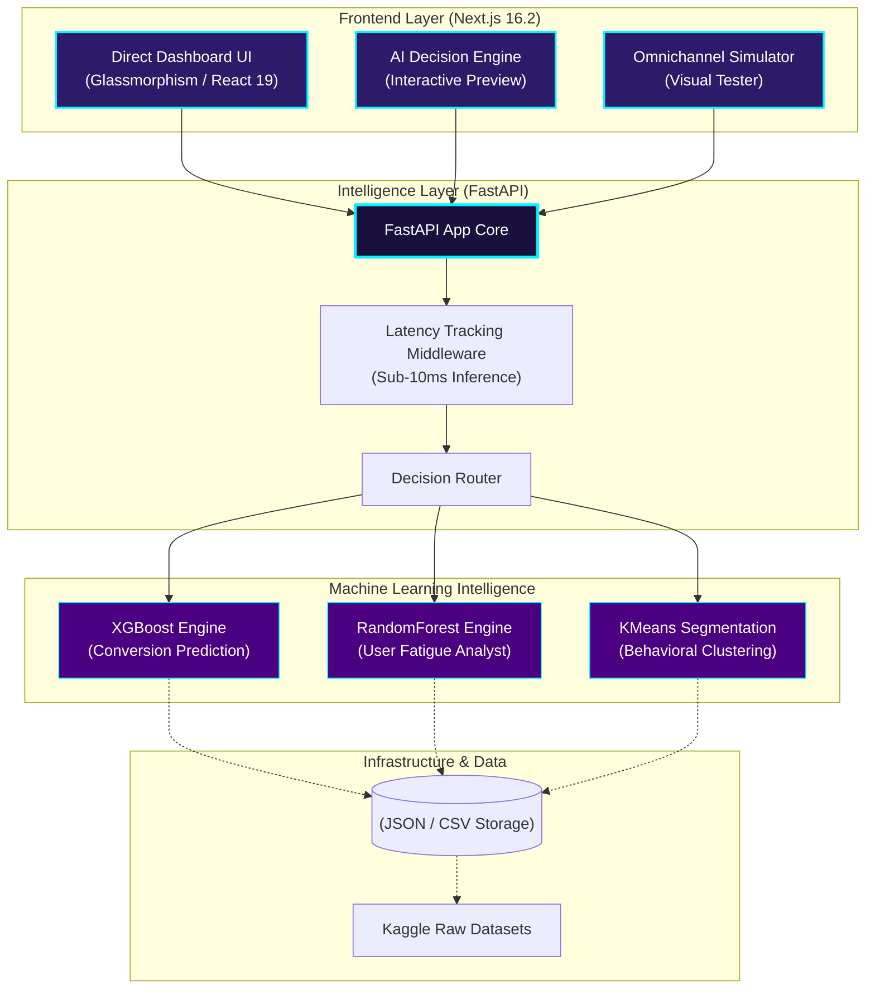
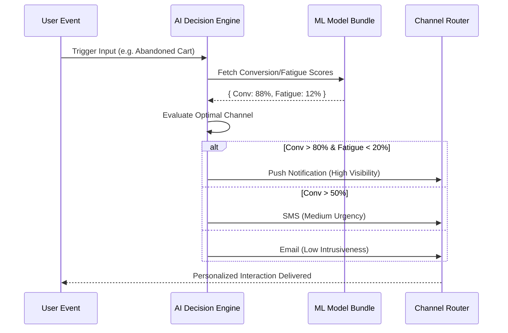
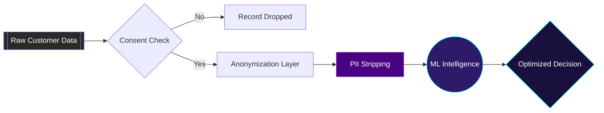

# System Architecture Visuals

This document contains high-fidelity architecture diagrams showcasing the full-stack depth of MessageMind AI. These assets are designed for use in pitch decks and technical deep-dives.

---

## 1. End-to-End System Architecture
This diagram illustrates the flow from the Next.js frontend through the FastAPI Intelligence Core to the specialized ML models.

> [!TIP]
> **Pitch Positioning**: Emphasize the "Sub-10ms Inference" middleware. This proves that MessageMind AI is built for real-time edge decisioning, not just static reporting.

---

## 2. Omnichannel Routing Intelligence
How MessageMind AI decides which channel to use for a specific user persona.

---

## 3. Privacy & Governance Lifecycle
Visual evidence of our "Privacy-By-Design" architecture.

---

## Visual Branding Identity
When presenting these diagrams, align with the following MessageMind styles:
- **Primary Background**: `#0F0A1E` (Deep Space Purple)
- **Highligh Color**: `#00F5FF` (Neon Cyan)
- **Glassmorphism**: 15% opacity white overlays with 10px blur.
- **Typography**: Inter or Outfit (Clean, modern sans-serif).
