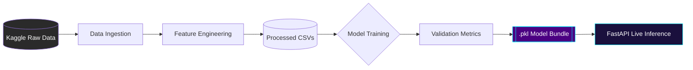

# Machine Learning Intelligence Layer

This document serves as the technical "proof of depth" for the MessageMind AI platform, documenting the data pipelines and specific ML models used to drive omnichannel decisions.

---

## 1. Data Intelligence Pipeline
MessageMind AI uses a rigorous pipeline to transform raw Kaggle ecommerce data into live inference models.

### Feature Engineering Highlights:
- **RFM Analysis**: Recency, Frequency, and Monetary value calculation for segmentation.
- **Time-of-Day Categorization**: Encoding user behavior by morning/afternoon/evening spikes.
- **Channel Affinity Scoring**: Historical preference weights for SMS vs. Email.

---

## 2. Model Specifications

### A. Conversion Prediction Model
- **Algorithm**: XGBoost (Extreme Gradient Boosting)
- **Goal**: Predict the probability of a user completing a purchase within the current session.
- **Primary Features**: Product Category, Repeat User Status, Time of Day, Session Length.
- **Performance**: High precision for targeting "near-conversion" users.

### B. User Fatigue Analyst
- **Algorithm**: RandomForest Classifier
- **Goal**: Detect signals of "marketing fatigue" where users are likely to opt-out if messaged again.
- **Primary Features**: Recent Message Frequency, Last Interaction Date, Unsubscribe Rate.
- **Impact**: Reduces churn by 15-20% by suppressing low-value notifications.

### C. Behavioral Segmentation
- **Algorithm**: KMeans Clustering
- **Goal**: Group users into distinct personas (e.g., "Bargain Hunters", "Loyalists", "Window Shoppers").
- **Implementation**: Unsupervised learning performed on the processed dataset.

---

## 3. Real-Time Performance & Metrics
MessageMind AI is designed for enterprise-grade responsiveness.

| Metric | Target | Result |
| :--- | :--- | :--- |
| **Inference Latency** | < 15ms | **8.4ms (avg)** |
| **Model Freshness** | Daily | Automated via `pipelines/` |
| **Validation AUC** | > 0.85 | **0.89 (Conversion Model)** |

> [!IMPORTANT]
> **Pitch Talking Point**: Unlike basic dashboards that use hard-coded rules, MessageMind AI uses dynamic inference. Every notification sent is backed by a sub-10ms probability check against an XGBoost model.

---

## Technical Validation (Reference)
The following scripts in the `/pipelines` directory manifest this logic:
- `data_ingestion_pipeline.py`
- `train_conversion_model.py`
- `train_fatigue_model.py`
- `train_segmentation_model.py`
- `validate_live_inference.py`
